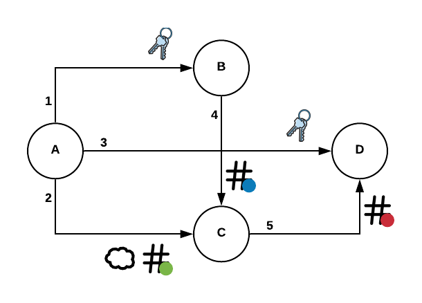
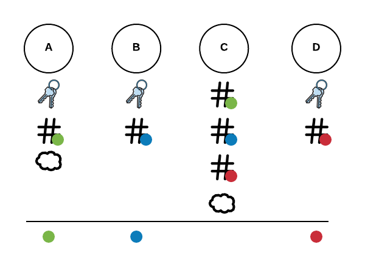
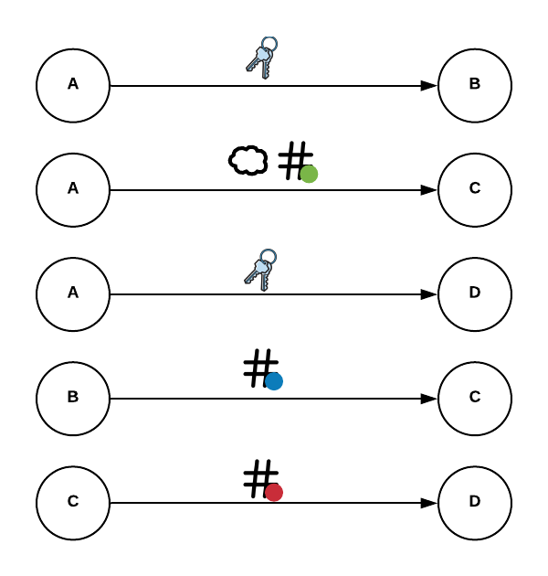

# FHE Compute

Ran on AWS p2.xlarge with the Deep Learning Base AMI (Ubuntu) Version 17.0 (ami-0ff00f007c727c376). 

Instal deps
```
pip3 install pycuda --user  
pip3 install nufhe[pycuda] --user
```

This should only take a minute or two, and you should be setup to run the encryption algos. 



The above chart shows the high level intended interactions with the scripts. Since we are just saving files to the filesystem as a means to commuication between A, B ,C and D. The lines show the concept of sending this information to each node but in the code they are just reading from the file system (these could run on seperate devices to achieve the intended security)



Here we can see the data that each node "knows".  

The A node knows the most variable data. It knows the secret key, the green input valie, the green hashed input value and the cloud key.  

The B node knows the secret key, the blue input value, and the blue hashed input value.

The C node only knows the hashed values of green and blue input values, and they compute a new hashed red output value. With never seeing the actual data the computer was able to do a comparison computation on the data. A person with the secret key can now decrypt this hashed red output value

The D node knows the secret key and the hashed red output value. It can decrypt this to the red output value. Which is a True False statement if green and blue inputs were equal.



This shows the movement of data as above in the high level image, but its easier to see each step here. 